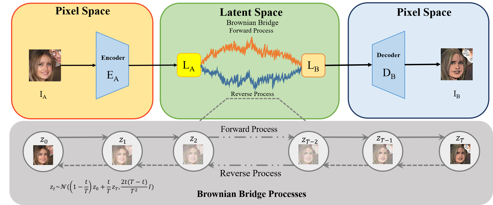

# Brownian Bridge Diffusion Models
***
#### [BBDM: Image-to-image Translation with Brownian Bridge Diffusion Models](https://arxiv.org/abs/2205.07680)
https://arxiv.org/abs/2205.07680

**Bo Li, Kai-Tao Xue, Bin Liu, Yu-Kun Lai**



## Requirements
```commandline
cond env create -f environment.yml
conda activate BBDM
```

## Data preparation
### Paired translation task
For datasets that have paired image data, the path should be formatted as:
```yaml
your_dataset_path/train/A  # training reference
your_dataset_path/train/B  # training ground truth
your_dataset_path/val/A  # validating reference
your_dataset_path/val/B  # validating ground truth
your_dataset_path/test/A  # testing reference
your_dataset_path/test/B  # testing ground truth
```
After that, the dataset configuration should be specified in config file as:
```yaml
dataset_name: 'your_dataset_name' # 'Cdata'
dataset_type: 'custom_aligned'
dataset_config:
  dataset_path: 'your_dataset_path' # '/Users/dorisadriana/Downloads/Cdata'
```

### Colorization and Inpainting
For colorization and inpainting tasks, the references may be generated from ground truth. The path should be formatted as:
```yaml
your_dataset_path/train  # training ground truth
your_dataset_path/val  # validating ground truth
your_dataset_path/test  # testing ground truth
```

#### Colorization
For generalization, the gray image and ground truth are all in RGB format in colorization task. You can use our dataset type or implement your own.
```yaml
dataset_name: 'your_dataset_name'
dataset_type: 'custom_colorization or implement_your_dataset_type'
dataset_config:
  dataset_path: 'your_dataset_path'
```

#### Inpainting
We randomly mask 25%-50% of the ground truth. You can use our dataset type or implement your own.
```yaml
dataset_name: 'your_dataset_name'
dataset_type: 'custom_inpainting or implement_your_dataset_type'
dataset_config:
  dataset_path: 'your_dataset_path'
```

## Train and Test
### Specify your configuration file
Modify the configuration file based on our templates in <font color=violet><b>configs/Template-*.yaml</b></font>
Don't forget to specify your VQGAN checkpoint path and dataset path.
### Specity your training and tesing shell
Specity your shell file based on our templates in <font color=violet><b>configs/Template-shell.sh</b></font>

If you wish to train from the beginning
```commandline
python3 main.py --config configs/Template_LBBDM_f4.yaml --train --sample_at_start --save_top --gpu_ids 0 
```

If you wish to continue training, specify the model checkpoint path and optimizer checkpoint path in the train part.
```commandline
python3 main.py --config configs/Template_LBBDM_f4.yaml --train --sample_at_start --save_top --gpu_ids 0 
--resume_model path/to/model_ckpt --resume_optim path/to/optim_ckpt
```

If you wish to sample the whole test dataset to evaluate metrics
```commandline
python3 main.py --config configs/Template_LBBDM_f4.yaml --sample_to_eval --gpu_ids 0 --resume_model path/to/model_ckpt
```

Note that optimizer checkpoint is not needed in test and specifying checkpoint path in commandline has higher priority than specifying in configuration file.

### Run
```commandline
sh shell/your_shell.sh
```

## Pretrained Models
For simplicity, we re-trained all of the models based on the same VQGAN model from LDM.

The pre-trained VQGAN models provided by LDM can be directly used for all tasks.  
https://github.com/CompVis/latent-diffusion#bibtex

All of our models can be found here.
https://pan.baidu.com/s/1xmuAHrBt9rhj7vMu5HIhvA?pwd=hubb

## Acknowledgement
Our code is implemented based on Latent Diffusion Model and VQGAN

[Latent Diffusion Models](https://github.com/CompVis/latent-diffusion#bibtex)  
[VQGAN](https://github.com/CompVis/taming-transformers)

## Citation
```
@inproceedings{li2023bbdm,
  title={BBDM: Image-to-image translation with Brownian bridge diffusion models},
  author={Li, Bo and Xue, Kaitao and Liu, Bin and Lai, Yu-Kun},
  booktitle={Proceedings of the IEEE/CVF Conference on Computer Vision and Pattern Recognition},
  pages={1952--1961},
  year={2023}
}
```
